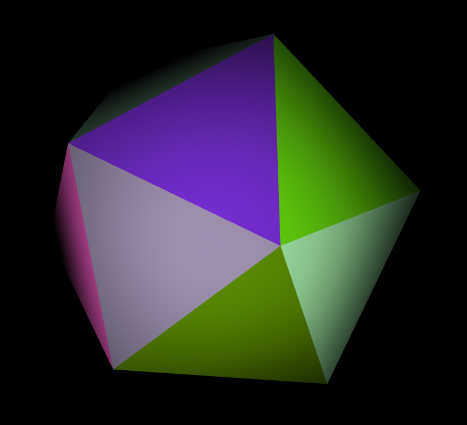
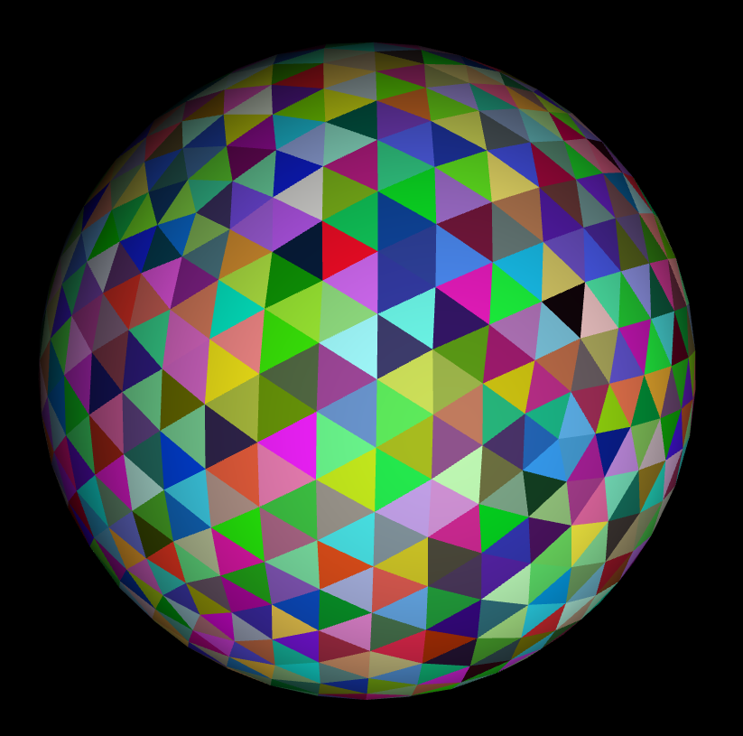
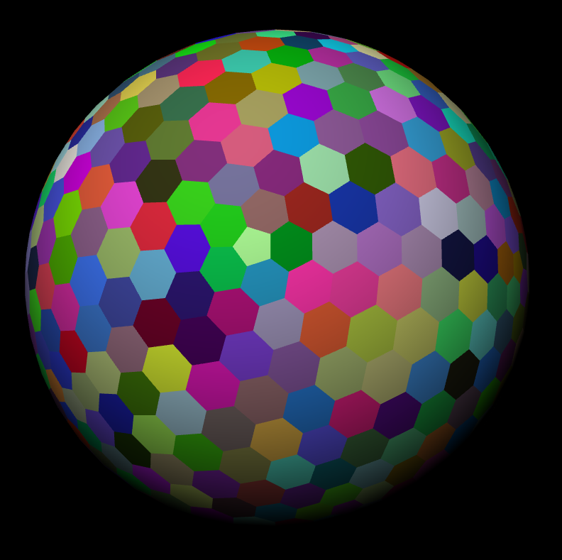
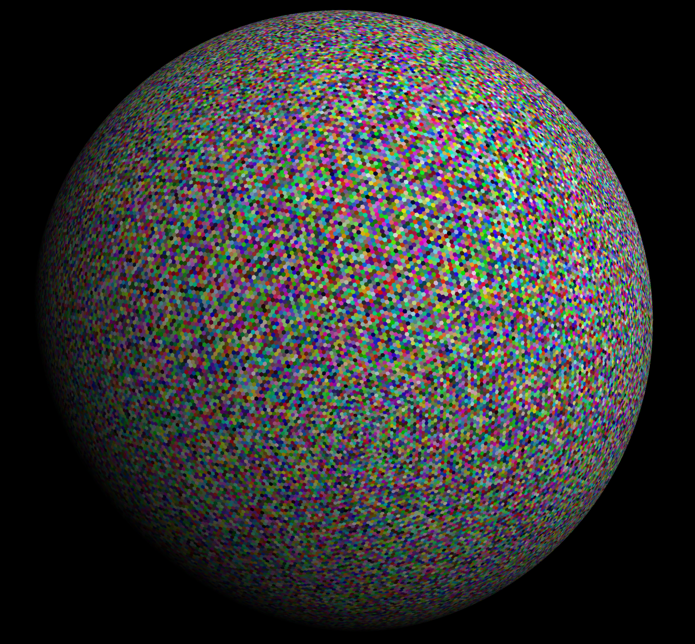

Generates the shapes and then serializes them to a file with a list of vertices 
(`positions`) and a list of triangle faces (`cells`) that index into the list of 
vertices. Suitable for input into [Three.js's 
BufferGeometry](https://threejs.org/docs/#api/en/core/BufferGeometry) or 
[regl](https://github.com/regl-project/regl/blob/gh-pages/example/camera.js).

Icosahedrons can be generated significantly faster than Three.js's version in 
JavaScript (which I pretty much copied into Rust).

Trunacated icosahedrons (I call them hexspheres) are a bit slower to generate 
since they are made by generating a icosahedron and then truncating every point 
into hexagon and pentagon faces.

The program can also add color to each face by assigning each vertex a color, 
but this comes at the cost of duplicating the shared vertices in the base model 
so each face has a unique set of vertices, greatly increasing the size of the 
mesh.

When rendering hexspheres of detail level 5 and higher and icosahedrons of 
detail level of 7 and higher in WebGL, make sure to enable the 
[`OES_element_index_uint`](https://developer.mozilla.org/en-US/docs/Web/API/OES_element_index_uint) 
extension since the number of vertices might overflow the normal int index.

## Screenshots

To generate a detailed hexsphere, it starts with base icosahedron:



Subdivides it's sides into a more detailed icosahedron:



Then, truncates every point in the icosahedron into hexagons and 12 pentagons:



Up to any detail level:



## Install

To install, either run `cargo install icosahedron` or checkout the repo and run 
`cargo build --release`.

## Usage

Run it with the following options:

```
icosahedron 1.0
Tyler Hallada <tyler@hallada.net>
Generates 3D icosahedra meshes

USAGE:
    icosahedron [FLAGS] [OPTIONS] [OUTPUT]

FLAGS:
    -c, --colored      Assigns a random color to every face (increases vertices count).
    -h, --help         Prints help information
    -t, --truncated    Generate truncated icosahedra (hexspheres).
    -V, --version      Prints version information

OPTIONS:
    -d, --detail <detail>    Maximum detail level to generate. Each level multiplies the number of triangles by 4.
                             [default: 7]
    -f, --format <format>    Format to write the files in. [default: Bin]  [possible values: Json, Bin]
    -r, --radius <radius>    Radius of the polyhedron, [default: 1.0]

ARGS:
    <OUTPUT>    Directory to write the output files to. [default: output/]
```

## Output Format

Outputs in either JSON or custom binary format. The binary format (all little 
endian) is laid out as:

1. 1 32 bit unsigned integer specifying the number of vertices (`V`)
2. 1 32 bit unsigned integer specifying the number of triangles (`T`)
3. `V` * 3 number of 32 bit floats for every vertex's x, y, and z coordinate
4. `V` * 3 number of 32 bit floats for the normals of every vertex
5. `V` * 3 number of 32 bit floats for the color of every vertex
6. `T` * 3 number of 32 bit unsigned integers for the 3 indices into the vertex 
   array that make every triangle

An example of reading the binary format in JavaScript:

```javascript
fetch(binaryFile)
  .then(response => response.arrayBuffer())
  .then(buffer => {
    let reader = new DataView(buffer);
    let numVertices = reader.getUint32(0, true);
    let numCells = reader.getUint32(4, true);
    let shape = {
      positions: new Float32Array(buffer, 8, numVertices * 3),
      normals: new Float32Array(buffer, numVertices * 12 + 8, numVertices * 3),
      colors: new Float32Array(buffer, numVertices * 24 + 8, numVertices * 3),
      cells: new Uint32Array(buffer, numVertices * 36 + 8, numCells * 3),
    })
```
